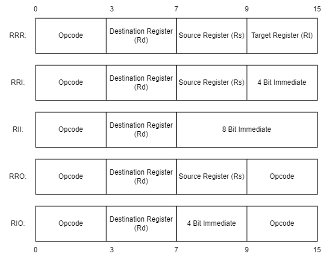

# The Iridium Assembler

Part of a series on my blog: [The System Fire](https://www.thesystemfire.com/).

The Iridium Assembler is an assembler for a custom instruction set made by the author of this repository as part of an ongoing project to eventually create a completely custom CPU emulated on a Raspberry Pi Pico that can run the 1993 verion of Doom.

The assembly language (and CPU) in question is 16 bits, with 16 registers of which 10 are general-purpose, but uses 32-bit addresses, giving 4 gigabytes of addressable RAM. There is also potential for up to 16 I/O ports, although there are only plans for:
 - VGA video
 - 16-bit audio
 - Off-chip non-volatile memory, likely in the form of an SPI SD card


## Quickstart

To compile the program from the beginning, ensure you have the Rust cargo compiler installed, navigate to the root directory of the repository which is `iridium_assembler/`, and run the CMD command:

`cargo build [--release]`

With the command run, you can find the compiled executable in `iridium_assembler/target/release/iridium_assembler.exe` or in `iridium_assembler/target/debug/iridium_assembler.exe` depending on if you used the `--release` flag or not. 

To run the assembler, use: `iridium_assembler [source_filename] [output_filename]` where the source filename must end in the *.asm* extension.


## Assembly Language Specifications

As previously specified, the binary instructions in this instruction set architecture (ISA) are 16 bits (2 bytes) long. They are addressed in RAM using shortword addresses, meaning that 1 address corresponds to a 16-bit word and not an 8-bit byte. This means that instructions can be addressed more efficiently, at the expense of extra, and therefore more costly, hardware if this machine were to be built in real life.

All instruction formats split the instruction into 4, 4-bit sections, the first of which is always the opcode (the type of instruction). This would seem to restrict us to 16 instructions, however, when the first 4 bits are all 1s, this signals that the second 4 bits also encode the opcode, meaning that we can get 32 instructions overall.  


### Instructions and Formats

Instructions can be formatted as follows:



Where each block represents 4 bits. The formats are better explained as follows:
 - RRR: 4-bit opcode followed by 3 4-bit register indexes
 - RRI: 4-bit opcode followed by 2 4-bit register indexes and a 4-bit immediate
 - RII: 4-bit opcode followed by 1 4-bit register index and an 8-bit immediate
 - ORR: 8-bit opcode followed by 2 4-bit register indexes
 - ORI: 8-bit opcode followed by 1 4-bit register index and a 4-bit immediate

The available instructions are:
| Mnemonic | Opcode     | Type | Description                            | Example             |
|----------|------------|------|----------------------------------------|---------------------|
| NOP      | 16 0s      | N/A  | Do nothing this cycle                  | NOP                 |
| ADD      | 0001       | RRR  | Rd = Rs + Rt                           | ADD $g0, $g1, $g2   |
| SUB      | 0010       | RRR  | Rd = Rs - Rt                           | SUB $g0, $g1, $g2   |
| ADDI     | 0011       | RRI  | Rd = Rs + Imm                          | ADDI $g0, $zero, 1  |
| SUBI     | 0100       | RRI  | Rd = Rs - Imm                          | SUBI $g0, $g1, 4    |
| SLL      | 0101       | RRR  | Rd = Rs << Rt                          | SLL $g0, $g1, $g2   |
| SRL      | 0110       | RRR  | Rd = Rs >> Rt                          | SRL $g0, $g1, $g2   |
| SRA      | 0111       | RRR  | Rd = Rs >>> Rt                         | SRA $g0, $g1, $g2   |
| NAND     | 1000       | RRR  | Rd = ¬(Rs & Rt)                        | NAND $g0, $g1, $g2  |
| OR       | 1001       | RRR  | Rd = Rs \| Rt                          | OR $g0, $g1, $g2    |
| LOAD     | 1010       | RRR  | Rd = RAM[$ua + Rs + Rt]                | LOAD $g0, $g1, $g2  |
| STORE    | 1011       | RRR  | RAM[$ua + Rs + Rt] = Rd                | STORE $g0, $g1, $g2 |
| MOVUI    | 1100       | RII  | Set upper 8 bits of Rd to Imm          | MOVUI $g0, 100      |
| MOVLI    | 1101       | RII  | Set lower 8 bits of Rd to Imm          | MOVLI $g0, 100      |
| ADDC     | 1111xx0000 | ORR  | Rd = Rs + carry flag                   | ADDC $g0, $g1       |
| SUBC     | 1011xx0001 | ORR  | Rd = Rs - carry flag                   | SUBC $g0, $g1       |
| JUMP     | 1111xx0010 | ORR  | $pc = [Rd] [Rs]                        | JUMP $g0, $g1       |
| JAL      | 1111xx0011 | ORR  | $ra = $pc, $pc = [Rd] [Rs]             | JAL $g0, $g1        |
| CMP      | 1111xx0100 | ORR  | Set flags for Rd - Rs                  | CMP $g0, $g1        |
| BEQ      | 1111xx0101 | ORR  | $pc = [Rd] [Rs] if 0 flag set          | BEQ $g0, $g1        |
| BNE      | 1111xx0110 | ORR  | $pc = [Rd] [Rs] if 0 not flag set      | BNE $g0, $g1        |
| BLT      | 1111xx0111 | ORR  | $pc = [Rd] [Rs] if no flags set        | BLT $g0, $g1        |
| BGT      | 1111xx1000 | ORR  | $pc = [Rd] [Rs] if negative flag set   | BGT $g0, $g1        |
| IN       | 1111xx1001 | ORI  | Rd = input from I/O port given by Imm  | IN $g0, 2           |
| OUT      | 1111xx1010 | ORI  | Output Rd to I/O port given by Imm     | OUT $g0, 2          |
| syscall  | 1111xx1100 | ORI  | OS interrupt given by Imm with arg $Rd | syscall $g0, 5      |
| HALT     | 16 1s      | N/A  | Halts execution of process             | HALT                |


The format of the instructions when writing them is to write the label (covered later), then the instruction mnemonic, which must be in all capitals with the exception of the *syscall* instruction, then any registers, then any immediates, then any label operands. For example, the following are valid instructions:

```
ADD  $g0, $g1, $g2 ; $g0 = $g1 + $g2
SUB  $g5, $g6, $g9 ; $g5 = $g6 - $g9
ADDI $g6, $zero, 1 ; $g6 = 0 + 1
```

But the following are invalid and will cause an error by the assembler:
```
$g0, $g1, $g2, ADD
ADDI 5, $g0, $g1
SUBO $5, $g0, $g1
JUMP @somewhere, $g0, $g1
```


### Available Registers

There are 16 registers available in the system indexed using 4 bits from *0x0* to *0xF*, of which 12 will be 16-bits, and 4 will be 32-bits in size. Registers are marked using a '\$' symbol, such as *\$g5* and *\$pc*.

The general-purpose (GP) registers are as follows and are indexes 0x0 to 0xA in the order listed below:
 - *\$zero*, which is read-only and always holds the value 0,
 - The registers *\$g0* to *\$g9*, which are intended to be used for almost any purpose the programmer wants, such as storing operands, arguments to functions, loop counters, etc.

The special-purpose (SP) registers are as follows and are index 0xB to 0xF in the order listed below:
 - The upper address (*\$ua*) register, which stores the upper 16 bits address of the when executing a LOAD or STORE instruction,
 - The stack pointer (*\$sp*) which is a 32-bit register and stores the address of the top of the stack,
 - The frame pointer (*\$fp*) which is 32-bits and stores the address of the start of the current frame (mainly for use by compilers),
 - The return address (*\$ra*) which is 32-bits and stores the address the current function or subroutine should jump to upon completion - automatically set by the JAL instruction,
 - The program counter (*\$pc*) which is 32-bits and stores the address of the next instruction to be executed (usually assuming no branch).


### Labels

When programming jumps and loading data from RAM, it is useful to be able to reference it via a label which is automatically converted to a numerical address by the assembler.

In this assembly language, labels are allowed to contain all standard upper- and lower-case Latin characters, underscores, and numerical digits (but not in the first position). These labels can be put on the same line as the instruction they label, or on their own on the previous line, and must always end with a colon. These are valid labelled instructions:
```
adding: ADD $g0, $g1, $g2
Sub_traction: SUB $g0, $g1, $g2
_increment123:
    ADDI $g1, $g2, $g3
```

However, these are not:
```
123invalid: NOP
Bad£_character: MOVLI $g0, 40
nothing_here: 
```

It is also important to use labels as some instructions, usually branch and load/store instructions, are expanded into more than 1 instruction by the assembler when they are used with a label. These instructions are called pseudo-instructions.

To reference a label in an instruction, the label should always go at the end of the instruction and be preceeded by an '@' symbol. For example, to jump unconditionally to the address of the instruction labelled 'loop_start', you would write:
```
JUMP $g0, $g1, @loop_start
```

In reality, this instruction is expanded to 5 instructions by the assembler. Ignore the 'l' and 'u' prefixes, only the assembler may use them, but they denote whether the upper or lower 16-bits of the 32-bit address are being referred to.
```
MOVUI $g0, u@loop_start
MOVLI $g0, u@loop_start
MOVUI $g1, l@loop_start
MOVLI $g1, l@loop_start
JUMP $g0, $g1
```


### Adding Data

Sometimes, the programmer may want to add data larger than a 4 or 8-bit immediate, or in non-numerical form, or in the form of a variable with an initial value already known at the time of assembly. To allow this, we use data instructions, which can represent the following types:
 - Integers (*.int*) - represent 16-bit signed integers,
 - Long integers (*.long*) - represent 32-bit signed integers,
 - Half-floats (*.half*) - represent 16-bit half-length IEEE 754 floating point numbers,
 - Floats (*.float*) - represent 32-bit regular-length IEEE 754 floating point numbers,
 - Characters (*.char*) - represent UTF-16 encoded characters, the character must be surrounded by single quotes,
 - Text (*.text*) - represent strings of UTF-16 encoded characters in the form of an array of characters, the text must be surrounded by double quotes,
 - Sections (*.section*) - represent an array of 16-bit, comma-separated values which can be interpreted as any data type desired. The array must be surrounded by square brackets. 

The array types *.text* and *.section* are required to have a length. This length specifies the number of words in RAM to allocate to them, which may be more than is necessary (extra words are set to 0x0000 or the '\0' null character), but not less. The *.text* instruction requires 1 more word than the length of the text for a null character, which denotes the end of the string in memory.

Data instructions MUST GO AFTER A "data:" LABEL which must go after all regular instructions, or the assembler will raise an error. The format of a data instruction in the data section is as follows, note that the data type is always preceeded by a dot, and may be preceeded by a label as well:

```[<label>:] .<type> [array size] <data>```.

For example, this valid data section demonstrates the formatting of all the data types:
```
...instructions here...
data:
    fifty: .int 50
    fifty_thousand: .long 50000
    small_float: .half 5.25
    pi: .float 3.14159265359
    character: .char 'a'
    text: .text 13 "Hello world!"
    fib_array: .section 20 [0x0001, 0x0001, 0x0002, 0x0003, 0x000A]
```

As a final note, in this version of the assembler, the data section in the compiled program binary is noted by the sequence of bytes 0x64, 0x61, 0x74, 0x61, 3A, 0x00, 0x00. This is used by a program loading the binary into RAM to know where the words to put into the data segment of memory start. The data segment is assumed to start at the address 0x00100000, but in future a feature will be added to allow this to be configured on the command line when running the assembler. 


## Assembly Process Summary

The process of assembling a file is as follows:
 1. Validation: going line-by-line through the raw assembly and checking each one is valid, the process for which is:
    1. Label validation: checking if there is a label and validating that there are no illegal characters if there is
    2. Validating opcodes: checking that the line's opcode is of a real instruction,
    3. Validating operands: checking that the operands of the particular instruction are of the right type and in the right place,
    4. Data validation: for data instructions, checking that the data supplied is in the right format and can fit into the number of bits/bytes/words provided.
 2. Token Generation: again going line-by-line through the raw assembly and converting the lines into tokens which are more easily processible by the rest of the assembler, (i.e. by separating the operands into different fields and converting immediates from strings to numbers),
 3. Pseudo-Instruction Substitution: substituting instructions that use label operands for more instructions that can load the proper values,
 4. Label Table Generation: creating a hashmap that maps textual labels to the addresses they correspond to,
 5. Binary Generation: generating the binary equivalent of each token and writing it to the output file. 


## Appendix A: A Program to Calculate Fibonnaci Numbers
The program below calculates the Fibonnaci sequence up to 30,000 and stores the result in an array:

```
init:
    ADD $g9, $zero, $zero           ; initialise array offset to point to first element
    ADDI $g0, $zero, 1              ; 1st element of sequence = 1  
    ADDI $g1, $zero, 1              ; 2nd element of sequence = 2
    LOAD $g5, $g8, $g9, @target     ; load number to stop at

loop:
    ADD $g2, $g0, $g1               ; get next element in sequence
    ADD $g0, $zero, $g1
    ADD $g1, $zero, $g2    

    STORE $g0, $g8, $g9, @results   ; store element in array
    ADDI $g9, $g9, 1                ; increment element offset
    
    CMP $g1, $g5                    ; jump to end if last element > target, otherwise loop again
    BGT $g8, $g7, @end
    JUMP $g8, $g7, @loop

end: HALT                           ; stop execution


data:
    target:  .int 30000
    results: .section 32 []
```
